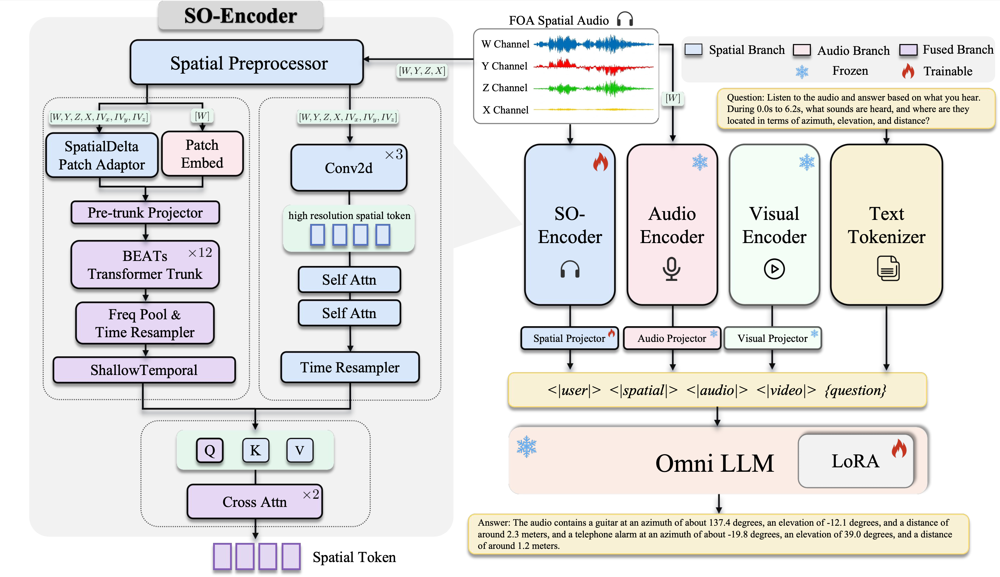

# Spatial-Omni: Spatial Audio Understanding Integration in Multimodal LLMs via FOA Encoding


Recent multimodal large language models mainly process audio as monaural signals, thereby discarding the spatial cues contained in spatial audio for sound localization, spatial relation reasoning, and spatial scene understanding. We propose Spatial-Omni, a lightweight method that implements SO-Encoder to inject First-Order Ambisonics (FOA) spatial audio into existing Omni LLMs as an independent modality, without modifying their original audio encoders. SO-Encoder provides spatial tokens with limited additional context cost and improves spatial audio understanding through efficient staged training. To support training and evaluation, we construct SO-Dataset, SO-QA, and SO-Bench from open-source data, real recordings, and simulations, containing 400K FOA spatial audio clips and 2.1M spatial question answering pairs. SO-Bench covers 16 spatial audio understanding subtasks, including basic detection and location estimation, spatial relation understanding, and complex spatial reasoning. Experiments show that Spatial-Omni outperforms existing open-source Large Audio-Language Models (LALMs) and Omni LLM models on spatial audio understanding tasks while retaining a reasonable level of general audio understanding.

**Spatial audio understanding on top of Qwen2.5-Omni.** Spatial-Omni augments
the Qwen2.5-Omni-7B LLM with a dedicated spatial encoder (**SO-Encoder**) that
turns first-order ambisonic (FOA) audio into low-rate spatial tokens, and
injects them into the LLM via a `<|spatial|>` placeholder.

| Variant | Base LLM        | Spatial encoder | Trainer          |
|---------|-----------------|-----------------|------------------|
| SO-7B   | Qwen2.5-Omni-7B | SO-Encoder      | `train_so_qa.py` |

The SO-Encoder is a BEATs-based, spatially-pretrained encoder that emits
2.5 Hz spatial tokens. (Two baselines also ship for comparison — a DCASE 2024
SELD backbone and a lightweight intensity-vector path — but the SO-Encoder
pipeline below is the main, recommended route.)

The two evaluation assets are:

- **[SO-Dataset](https://huggingface.co/datasets/dieKarotte/SO-Dataset)** — FOA SELD audio data with annotation & FOA spatial QA training data.
- **[SO-Bench](https://huggingface.co/datasets/dieKarotte/SO-Bench)**   — Held-out spatial QA test set.

### Contents

1. [Environment](#1-environment) — conda install + env vars
2. [Data: SO-Dataset / SO-Bench](#2-data-so-dataset--so-bench) — download, extract, schema
3. [SO-Encoder pretraining & evaluation](#3-so-encoder-pretraining--evaluation) — `train_so_pretrain` + `bench_so_encoder`
4. [SO-7B QA fine-tuning (3 stages)](#4-so-7b-qa-fine-tuning-3-stages) — `train_so_qa`
5. [Inference & evaluation on SO-Bench](#5-inference--evaluation-on-so-bench) — `bench_test_generate` + `score_test_predictions`
6. [Repository layout](#6-repository-layout)
7. [Citations](#7-citations)
8. [License](#8-license)

> **SO-30B (Qwen3-Omni-MoE) variant** lives on the `feat/so-30b-qwen3` branch
> with its own environment (`environment-so30b.yml`). See
> [SO-30B QA fine-tuning](#4b-so-30b-qwen3-omni-moe-qa-fine-tuning) below.

---

## 1. Environment

Tested target: **Python 3.11, CUDA 12.4, PyTorch 2.5.1** on NVIDIA A100.

### Install with conda (recommended)
```bash
conda env create -f environment.yml
conda activate spatial-omni
```

This pins every dependency to the exact versions the repo is developed and
tested against (`transformers==4.52.0`, `peft==0.17.1`, `torch==2.5.1+cu124`,
etc.). `nvidia-smi` may report a higher CUDA version — that is the driver
capability; the cu124 wheels run on any driver that is 12.4-capable or newer.

### Install with pip (alternative)
```bash
python3.11 -m venv .venv && source .venv/bin/activate
pip install torch==2.5.1 torchaudio==2.5.1 --index-url https://download.pytorch.org/whl/cu124
pip install -r requirements.txt
```

> The trainers default to `--attn-impl sdpa`, so **flash-attn is not required**.
> To enable it for extra speed: `pip install flash-attn==2.8.3 --no-build-isolation`.

### External dependencies (set once via env vars)

The BEATs model code is **vendored** under `spatial_omni/encoders/beats/`,
so you do **not** need to clone `microsoft/unilm`. Only the trunk weights
file is needed, and only for SO-Encoder pretraining.

```bash
# 1) HuggingFace base model (REQUIRED for QA fine-tune & bench)
huggingface-cli download Qwen/Qwen2.5-Omni-7B --local-dir ./Qwen2.5-Omni-7B
export SO_BASE_MODEL=$PWD/Qwen2.5-Omni-7B

# 2) SO-Dataset root (REQUIRED for §2/§3/§4/§5)
#    Download instructions in §2.
export SO_DATASET_ROOT=/path/to/SO-Dataset
export SO_VOCAB=$SO_DATASET_ROOT/so_vocab.csv          # ships with the release

# 3) Pretrained SO-Encoder checkpoint (REQUIRED for QA fine-tune & bench)
#    Either train it yourself via §3.1, or download the released checkpoint.
export SO_ENCODER_CKPT=/path/to/so_encoder_pretrained.pt

# 4) (Optional) Upstream BEATs trunk weights — ONLY for SO-Encoder pretraining (§3.1).
#    QA fine-tune (§4) and bench (§5) do NOT need this.
#    Download `BEATs_iter3_plus_AS2M.pt` from microsoft/unilm releases:
#    https://github.com/microsoft/unilm/tree/master/beats
# export SO_BEATS_TRUNK_CKPT=/path/to/BEATs_iter3_plus_AS2M.pt

# 5) (Optional) Repo root for sys.path; auto-detected from the script
#    location. Set only if you launch trainers from a different cwd.
# export SO_REPO=$PWD

# 6) (Optional) DCASE 2024 SELD baseline — vendored under
#    spatial_omni/encoders/seldnet/, so an external checkout is NOT needed.
#    Set DCASE_BASELINE_REPO only if you want to use a different fork or
#    point at an external SELD baseline repo (rarely needed).
# git clone https://github.com/sharathadavanne/seld-dcase2024.git
# export DCASE_BASELINE_REPO=$PWD/seld-dcase2024
# export SELD_FEATURE_STATS_DIR=/path/to/seld_feat_label/...

# 7) (Optional) SO_BEATS_REPO — legacy sys.path injection for an external
#    unilm/beats checkout. The repo's vendored copy works without it; set
#    only if you want `from BEATs import BEATs` to resolve to an external
#    unilm tree (rarely needed).
# export SO_BEATS_REPO=/path/to/unilm/beats
```

> **Quick start (QA fine-tune & bench only)**: you only need
> `SO_BASE_MODEL`, `SO_DATASET_ROOT`, and `SO_ENCODER_CKPT` (items 1–3).
> Item 4 (BEATs trunk) is required only if you want to *pretrain the
> SO-Encoder yourself* (§3.1). Items 5–7 are advanced overrides.

---

## 2. Data: SO-Dataset / SO-Bench

### 2.1 Use the public release (recommended)

The 63-class SO-Dataset is released on HuggingFace as
[`dieKarotte/SO-Dataset`](https://huggingface.co/datasets/dieKarotte/SO-Dataset)
— ~1.1 TB of path-preserving tar shards. Download and extract:

```bash
pip install -U "huggingface_hub[cli]"
hf download dieKarotte/SO-Dataset --repo-type dataset --local-dir SO-Dataset

# Full extraction (1 TB; ~30 min I/O on 4 workers)
PYTHONPATH=. python scripts/data/extract_so_dataset.py \
    --src ./SO-Dataset --dst ./SO-Dataset \
    --splits train valid test --workers 4
```

Layout after extraction:
```
SO-Dataset/
├── audio/{train,valid,test}/foa_*.wav     (FOA, 4-ch, 16 kHz)
├── annotations/{train,valid,test}/foa_*.csv  (DCASE-style frame CSV;
│                                              including foa_*_src*.csv)
├── metadata/{train,valid,test}.jsonl      (scene-level JSONL)
├── qa/{train,valid,test}.jsonl            (1.45 M QA pairs total)
├── so_vocab.csv                           (63-class taxonomy, frequency-sort,
│                                            row N = SO-Encoder cls-head dim N)
└── manifests/                             (per-shard summary)
```

```bash
export SO_DATASET_ROOT=$PWD/SO-Dataset
export SO_VOCAB=$SO_DATASET_ROOT/so_vocab.csv
```

The release ships `so_vocab.csv` directly — you don't need to regenerate it.
The CSV's row order (FSD50K frequency-descending) **must match** the SO-Encoder
checkpoint's classification head, so do not re-sort. The `label_id` integer in
each `metadata/*.jsonl` source matches the `label_id` column of `so_vocab.csv`
(both `0..62`); the loader joins by the `label` string, but the integer is
kept consistent for users wiring custom pipelines.


### 2.2 QA jsonl schema

`qa/{train,valid,test}.jsonl` — one record per line:

```json
{
  "qa_id": "qa_eaf8872e6092f714cbc5",
  "split": "train",
  "audio_id": "foa_2562b7c3a26059f6030e",
  "audio_path": "audio/train/foa_2562b7c3a26059f6030e.wav",
  "dataset": "hm3d",
  "task_type": "counting",
  "task_name": "identify_source_by_location",
  "question": "What is the sound source located to the front-left and below the listener?",
  "answer": "A string instrument is the sound source coming from the front-left and below.",
  "canonical_answer": "string instrument",
  "source_refs": [{"class_id": 47, "class_name": "string_instrument",
                    "azimuth_deg": 67.057, "elevation_deg": -36.558, "distance_m": 1.61, ...}]
}
```

`audio_path` is relative to `SO-Dataset/`. Pass `--qa-root SO-Dataset/qa --audio-root SO-Dataset` to the trainers / bench scripts so the QA loader can find the audio. The optional `prompt` field, if missing, is auto-mirrored from `question` at load time.

**SO-Bench** = `qa/test.jsonl` (7,877 records). Pass it via `--qa-root SO-Dataset/qa --audio-root SO-Dataset --split test` to the bench tools.

### 2.3 Bring your own QA dataset

A QA root is just a directory with `train.jsonl` / `valid.jsonl` / `test.jsonl`. The required fields are `audio_path`, `(prompt | question)`, `answer`. FOA audio must be 4-channel FOA WAV at 16 kHz, ≤20 s.

---

## 3. SO-Encoder pretraining & evaluation

The SO-Encoder is a BEATs-based spatial audio backbone that maps a 20 s FOA
clip to 50 spatial tokens (2.5 Hz, fed into the LLM via `<|spatial|>`).
Pretraining it on SO-Dataset is OPTIONAL — you can also start from the
released checkpoint and skip straight to §4.

### 3.1 Pretrain on SO-Dataset

**Required checkpoints / paths**

| Asset | Source | Where |
|---|---|---|
| BEATs trunk weights | `BEATs_iter3_plus_AS2M.pt` from [microsoft/unilm/beats](https://github.com/microsoft/unilm/tree/master/beats) | `$SO_BEATS_TRUNK_CKPT` |
| Source-class vocab | Ships with SO-Dataset release | `$SO_VOCAB` |
| FOA audio + per-source CSVs | SO-Dataset extracted layout | `$SO_DATASET_ROOT` |

**Step 1 — Build a pretraining manifest** (resolves `audio_path` / trajectory CSVs to absolute paths and drops missing files):
```bash
PYTHONPATH=. python scripts/data/build_so_pretrain_manifest.py \
    --metadata-jsonl $SO_DATASET_ROOT/metadata/train.jsonl \
    --data-root      $SO_DATASET_ROOT \
    --output         $SO_DATASET_ROOT/pretrain-train.jsonl \
    --filter-missing
```

**Step 2 — Launch DDP pretraining (8× A100 recommended)**:
```bash
torchrun --nproc_per_node=8 -m spatial_omni.encoders.beats.train_so_pretrain \
    --preset ov1 --distributed --ddp-find-unused-parameters \
    --ov1-manifest          $SO_DATASET_ROOT/pretrain-train.jsonl \
    --source-vocab-path     $SO_VOCAB --source-num-classes 63 \
    --pretrained-beats-ckpt $SO_BEATS_TRUNK_CKPT \
    --batch-size 2 --num-epochs 30 --learning-rate 1e-4 \
    --output-dir ./runs/so_encoder_pretrain
```
- `--ddp-find-unused-parameters` is required (auxiliary heads go unused on
  some batches).
- Single-GPU smoke (`--batch-size 16`, no `--distributed`) also works.

### 3.2 Evaluate an SO-Encoder checkpoint on the test split

`scripts/bench_so_encoder.py` reuses the trainer's `evaluate_one_epoch`, so
the metrics match the validation log printed during training (Official DCASE
SELD: F20, ER20, LE_CD, LR_CD, SELD_score, plus class accuracy and
azi/ele/dist MAE).

```bash
# 1) Build a test-split pretrain manifest
PYTHONPATH=. python scripts/data/build_so_pretrain_manifest.py \
    --metadata-jsonl $SO_DATASET_ROOT/metadata/test.jsonl \
    --data-root      $SO_DATASET_ROOT \
    --output         $SO_DATASET_ROOT/pretrain-test.jsonl \
    --filter-missing

# 2) Bench 
PYTHONPATH=. python scripts/bench_so_encoder.py \
    --checkpoint            /path/to/so_encoder_best.pt \
    --test-manifest         $SO_DATASET_ROOT/pretrain-test.jsonl \
    --source-vocab          $SO_VOCAB \
    --pretrained-beats-ckpt $SO_BEATS_TRUNK_CKPT \
    --batch-size 4 --num-workers 4 \
    --output-json /tmp/so_encoder_test_metrics.json
```

Reference metrics (released SO-Encoder, 1,632 test clips):

| Metric | F20 | ER20 | LE_CD (°) | LR_CD | SELD_score | class_acc | azi_mae (°) | ele_mae (°) | dist_mae (m) |
|---|---|---|---|---|---|---|---|---|---|
| Value | 0.486 | 0.528 | 13.63 | 0.575 | 0.386 | 0.873 | 10.05 | 4.47 | 0.359 |

> **`--source-vocab` must be the SAME vocab the checkpoint was trained on**
> (frequency-sort, identical to the released `SO-Dataset/so_vocab.csv`).
> An alphabetical or reordered vocab will silently mis-route the cls head
> and tank F20 to ~0.

---

## 4. SO-7B QA fine-tuning (3 stages)

Three sequential stages, each resumes from the previous stage's
`best_trainable.pt`. Use the bundled launcher
[`shell/launch_train_so_7b.sh`](shell/launch_train_so_7b.sh) for the
recommended schedule, or run the trainers directly:

**Required checkpoints / paths**

| Asset | Where |
|---|---|
| Qwen2.5-Omni-7B base model | `$SO_BASE_MODEL` (or `--model-id`) |
| Pretrained SO-Encoder | `$SO_ENCODER_CKPT` (or `--beats-checkpoint`) |
| QA + audio | `$SO_DATASET_ROOT/qa` and `$SO_DATASET_ROOT` |

```bash
# Stage 1 — train projector only (SO-Encoder + LLM frozen)
torchrun --nproc_per_node=4 train_so_qa.py \
    --projector-only \
    --qa-root    $SO_DATASET_ROOT/qa \
    --audio-root $SO_DATASET_ROOT \
    --beats-checkpoint $SO_ENCODER_CKPT \
    --attn-impl sdpa \
    --output-dir ./runs/so7b_stage1 \
    --epochs 5 --lr 1e-4

# Stage 2 — LLM LoRA + projector (SO-Encoder still frozen)
torchrun --nproc_per_node=4 train_so_qa.py \
    --encoder-lora \
    --resume-checkpoint-path ./runs/so7b_stage1/checkpoints/best_trainable.pt \
    --resume-model-only \
    --qa-root    $SO_DATASET_ROOT/qa \
    --audio-root $SO_DATASET_ROOT \
    --beats-checkpoint $SO_ENCODER_CKPT \
    --attn-impl sdpa \
    --output-dir ./runs/so7b_stage2 \
    --epochs 3 --lr 3e-5

# Stage 3 — unfreeze SO-Encoder + LoRA + projector
torchrun --nproc_per_node=4 train_so_qa.py \
    --beats-lora \
    --resume-checkpoint-path ./runs/so7b_stage2/checkpoints/best_trainable.pt \
    --resume-model-only \
    --qa-root    $SO_DATASET_ROOT/qa \
    --audio-root $SO_DATASET_ROOT \
    --beats-checkpoint $SO_ENCODER_CKPT \
    --attn-impl sdpa \
    --output-dir ./runs/so7b_stage3 \
    --epochs 3 --lr 1e-5
```

Important details:

- `--attn-impl sdpa` is required. The default `auto` auto-detects
  flash-attn 2 when installed, but the upstream Qwen2.5-Omni
  `_update_causal_mask` raises on `padding_side='right'` + flash-attn 2 and
  the trainer right-pads (label mask is on the right). `sdpa` (PyTorch
  native) bypasses the check.
- `--audio-root` lets the QA loader find audio when `audio_path` is relative
  to a different root than `--qa-root` (the SO-Dataset HF release puts
  `qa/` and `audio/` as siblings under the dataset root).
- Legacy checkpoints with the old `spatial_beats_*` / `seld233_*` keys are
  loaded transparently — see
  [`spatial_omni/utils/ckpt_compat.py`](spatial_omni/utils/ckpt_compat.py).

### Continuing from a previously-trained SO-7B checkpoint

To resume training (e.g. stage-3 LoRA on a new QA distribution) from any
existing `best_trainable.pt`:

```bash
torchrun --nproc_per_node=8 train_so_qa.py \
    --beats-lora \
    --resume-checkpoint-path /path/to/best_trainable.pt \
    --resume-model-only \
    --qa-root    $SO_DATASET_ROOT/qa \
    --audio-root $SO_DATASET_ROOT \
    --model-id        $SO_BASE_MODEL \
    --beats-checkpoint $SO_ENCODER_CKPT \
    --attn-impl sdpa \
    --output-dir ./runs/so7b_continue \
    --epochs 3 --batch-size 2 --grad-accum-steps 3 \
    --lr 3e-5 --lora-lr 3e-5 --projector-lr 1e-6 --beats-lr 1e-6 \
    --lora-r 16 --lora-alpha 32 \
    --lora-target-modules q_proj k_proj v_proj o_proj \
    --encoder-token-rate 10.0 --projector-shuffle-factor 4 \
    --warmup-ratio 0.03
```

`--resume-model-only` reloads the model state dict but reinitializes the
optimizer + scheduler — use this when starting a fresh schedule on top of
old weights. Drop the flag to fully resume optimizer/scheduler from a
crashed run.

---

## 4b. SO-30B (Qwen3-Omni-MoE) QA fine-tuning

> Available on the **`feat/so-30b-qwen3`** branch. SO-30B reuses the **same**
> SO-Encoder, QA data, 3-stage schedule, collator, LoRA wiring, checkpointing,
> and bench/score tooling as SO-7B — only the base LLM changes
> (Qwen2.5-Omni-7B → Qwen3-Omni-30B-A3B-Instruct, a MoE model). All spatial
> logic is shared; the Qwen3 path is a thin set of subclasses + a wrapper
> trainer.

### Separate environment (required)

SO-30B needs `transformers>=4.57.0` (the first release shipping the
`qwen3_omni_moe` model code), which is **incompatible** with SO-7B's pinned
`transformers==4.52.0`. Use a dedicated env — it does not affect the SO-7B env:

```bash
conda env create -f environment-so30b.yml
conda activate spatial-omni-30b
# (or: pip install -r requirements-so30b.txt into a fresh venv)
```

If you maintain a custom transformers source tree with `qwen3_omni_moe` (e.g. a
dev build), point the Qwen3 entrypoints at it without changing the env:

```bash
export QWEN3_TRANSFORMERS_FORK=/path/to/transformers/src
```

When unset, the pip-installed `transformers` is used directly.

### Required checkpoints / paths

| Asset | Where |
|---|---|
| Qwen3-Omni-30B-A3B-Instruct base model | `--model-id` |
| Pretrained SO-Encoder (same as SO-7B) | `--beats-checkpoint` |
| QA + audio | `$SO_DATASET_ROOT/qa` and `$SO_DATASET_ROOT` |

### 3-stage training

The flags are identical to SO-7B (`--projector-only` → `--encoder-lora` →
`--beats-lora`); just swap the entrypoint to `train_so_qa_qwen3.py` and the
`--model-id` to the Qwen3 base. The MoE is large, so pick one of:

- **DDP** (`torchrun --nproc_per_node=N`, one full model replica per GPU), or
- **accelerate sharding** for a single replica across GPUs via `--device-map auto`
  (set on the wrapper, which strips it before the inner parser sees it).

```bash
# Stage 3 example — unfreeze SO-Encoder + LoRA + projector (DDP across 8 GPUs)
torchrun --nproc_per_node=8 train_so_qa_qwen3.py \
    --beats-lora \
    --resume-checkpoint-path ./runs/so30b_stage2/checkpoints/best_trainable.pt \
    --resume-model-only \
    --model-id        /path/to/Qwen3-Omni-30B-A3B-Instruct \
    --beats-checkpoint $SO_ENCODER_CKPT \
    --qa-root    $SO_DATASET_ROOT/qa \
    --audio-root $SO_DATASET_ROOT \
    --attn-impl sdpa \
    --output-dir ./runs/so30b_stage3 \
    --epochs 3 --batch-size 1 --grad-accum-steps 8 \
    --lr 1e-5 --lora-lr 3e-5 --projector-lr 1e-6 --beats-lr 1e-6 \
    --lora-r 16 --lora-alpha 32 \
    --lora-target-modules q_proj k_proj v_proj o_proj \
    --encoder-token-rate 10.0 --projector-shuffle-factor 4
```

To shard one replica across GPUs instead of DDP, drop `torchrun` and pass
`--device-map auto`:

```bash
python train_so_qa_qwen3.py --beats-lora --device-map auto \
    --model-id /path/to/Qwen3-Omni-30B-A3B-Instruct \
    --beats-checkpoint $SO_ENCODER_CKPT \
    --qa-root $SO_DATASET_ROOT/qa --audio-root $SO_DATASET_ROOT \
    --attn-impl sdpa --output-dir ./runs/so30b_devmap ...
```

### Bench / score

`scripts/bench_test_generate_qwen3.py` is the Qwen3 counterpart of
`bench_test_generate.py` — same `predictions.jsonl` format, so
`scripts/score_test_predictions.py` works unchanged:

```bash
torchrun --nproc_per_node=8 scripts/bench_test_generate_qwen3.py \
    --checkpoint-paths ./runs/so30b_stage3/checkpoints/best_trainable.pt \
    --qa-root $SO_DATASET_ROOT/qa --audio-root $SO_DATASET_ROOT \
    --split test --batch-size 1 --num-workers 4 \
    --output-dir ./runs/so30b_stage3/bench/test

python scripts/score_test_predictions.py \
    --predictions-jsonl ./runs/so30b_stage3/bench/test/best_trainable/predictions.jsonl \
    --qa-root $SO_DATASET_ROOT/qa --split test \
    --output-json ./runs/so30b_stage3/bench/test/best_trainable/metrics.json
```

### Diagnostics

Two helpers verify a resumed SO-30B checkpoint before a full bench:

```bash
# Confirm generate() actually delivers spatial tokens into forward()
# (prefill forward must see spatial_audio != None).
python scripts/sanity_check_so_qwen3_generate.py \
    --ckpt ./runs/so30b_stage3/checkpoints/best_trainable.pt \
    --model-id /path/to/Qwen3-Omni-30B-A3B-Instruct \
    --beats-checkpoint $SO_ENCODER_CKPT \
    --qa-jsonl $SO_DATASET_ROOT/qa/test.jsonl

# Reproduce training-time valid_loss (forward only) to confirm the ckpt + build
# match what was trained.
python scripts/probe_valid_loss_so_qwen3.py \
    --ckpt ./runs/so30b_stage3/checkpoints/best_trainable.pt \
    --model-id /path/to/Qwen3-Omni-30B-A3B-Instruct \
    --beats-checkpoint $SO_ENCODER_CKPT \
    --qa-root $SO_DATASET_ROOT/qa --split valid --max-samples 64
```

### Qwen3-specific implementation notes

- **`prepare_inputs_for_generation` override is mandatory.** Upstream
  `Qwen3OmniMoeThinkerForConditionalGeneration` does not list the `spatial_*`
  kwargs, so without the override they are swallowed by `**kwargs` at inference
  and the spatial signal is silently dropped — collapsing
  azimuth/elevation/detect_time to chance even though valid_loss trains down.
  See [`spatial_omni/model/modeling_so_thinker_qwen3.py`](spatial_omni/model/modeling_so_thinker_qwen3.py).
- **`generate()` kwarg patch.** Qwen3 has no talker, so the wrapper strips
  `return_audio`/`speaker`/`use_audio_in_video` and injects
  `eos_token_id=151645` (`<|im_end|>`) + `pad_token_id=151643` so generation
  stops correctly (Qwen3's `generation_config.json` sets no eos).
- **MoE router aux loss disabled** during fine-tuning (it interacts poorly with
  frozen experts when only attention LoRA is trainable).
- Same `ckpt_compat` legacy-key remapping applies, so SO-Encoder checkpoints
  and any older Qwen3 trainable checkpoints load transparently.

---

## 5. Inference & evaluation on SO-Bench

`scripts/bench_test_generate.py` reads `train_args.json` next to each
checkpoint, so you do **not** pass `--model-id` / `--beats-checkpoint` /
`--beats-repo` on the CLI — those come from the saved training config.

### 5.1 Generate predictions on the test split

```bash
python scripts/bench_test_generate.py \
    --run-dir ./runs/so7b_stage3 \
    --checkpoint-tags best \
    --qa-root    $SO_DATASET_ROOT/qa \
    --audio-root $SO_DATASET_ROOT \
    --split test
```
Predictions land in `./runs/so7b_stage3/bench/test/best/predictions.jsonl`
(one record per line, with `prediction` / `prediction_cleaned` /
`raw_exact_match` / `cleaned_exact_match`).

Flags worth knowing:
- `--checkpoint-tags best last epoch_003` — bench multiple ckpts under
  `<run-dir>/checkpoints/`.
- `--checkpoint-paths /path/a.pt /path/b.pt` — explicit list (overrides `--run-dir`).
- `--checkpoint-glob 'step_0*_trainable.pt'` — sweep step ckpts.
- `--batch-size 1 --num-beams 4 --max-new-tokens 96` — generation knobs.

### 5.2 Score predictions

```bash
python scripts/score_test_predictions.py \
    --predictions-jsonl ./runs/so7b_stage3/bench/test/best/predictions.jsonl \
    --qa-root           $SO_DATASET_ROOT/qa --split test \
    --output-json       ./runs/so7b_stage3/bench/test/best/metrics.json \
    --md-output         ./runs/so7b_stage3/bench/test/best/metrics.md
```
Computes per-task accuracy, azimuth/elevation MAE, distance MAE,
direction-bin EM, and detection-task F1. The default thresholds are
configurable (`--azimuth-threshold-deg`, `--elevation-threshold-deg`, etc.).

Optional **LLM judge** for borderline-EM single-label tasks (uses an
OpenAI-compatible API, env var `SO_LLM_API_KEY`):
```bash
python scripts/score_test_predictions.py \
    --predictions-jsonl ./runs/so7b_stage3/bench/test/best/predictions.jsonl \
    --qa-root $SO_DATASET_ROOT/qa --split test \
    --llm-judge --llm-model gpt-4o \
    --llm-base-url https://api.openai.com/v1 \
    --output-json /tmp/metrics_with_judge.json
```

### 5.3 Sweep multiple checkpoints

```bash
python scripts/batch_bench_so_qa.py \
    --run-dir ./runs/so7b_stage3 \
    --qa-root $SO_DATASET_ROOT/qa --audio-root $SO_DATASET_ROOT \
    --split test
```
Runs `bench_test_generate.py` + `score_test_predictions.py` for every
checkpoint under `<run-dir>/checkpoints/`, writing one `metrics.json` per
ckpt.

### 5.4 Unified driver

```bash
torchrun --nproc_per_node=4 scripts/run_bench.py \
    --baseline so-7b \
    --run-dir  ./runs/so7b_stage3 \
    --qa-root  $SO_DATASET_ROOT/qa --audio-root $SO_DATASET_ROOT \
    --split    test
```
`scripts/run_bench.py` is a thin dispatcher that sets up DDP once and calls
the right generation sub-script. For the SO-7B SO-Encoder pipeline use
`--baseline so-7b`; `--baseline zero-spatial` runs the same backbone with the
spatial input zeroed out (diagnostic).

<!-- ### 5.5 Diagnostic ablations

Drop the Qwen mono `<|AUDIO|>` branch entirely (only spatial tokens reach
the LLM):
```bash
python scripts/bench_test_generate.py \
    --run-dir ./runs/so7b_stage3 --checkpoint-tags best \
    --qa-root $SO_DATASET_ROOT/qa --audio-root $SO_DATASET_ROOT \
    --split test --drop-mono-audio
```

Replace spatial input with zeros (measures how much the LLM relies on
spatial tokens):
```bash
python scripts/bench_test_generate.py \
    --run-dir ./runs/so7b_stage3 --checkpoint-tags best \
    --qa-root $SO_DATASET_ROOT/qa --audio-root $SO_DATASET_ROOT \
    --split test --spatial-ablation zero
```

Output dirs are auto-suffixed (`__drop_mono_audio`, `__zero` etc.) so you
don't overwrite the joint baseline. -->

---

## 6. Repository layout

```
Spatial-Omni/
├── README.md, LICENSE, .gitignore
├── requirements.txt, environment.yml
├── train_so_qa.py            # SO-7B trainer (3-stage) — the main entry point
├── spatial_omni/             # Python package
│   ├── model/                # Qwen2.5-Omni + Spatial-Thinker subclass
│   ├── modules/              # SO-Encoder, projectors (+ SELD/IV adapters)
│   ├── encoders/beats/       # vendored BEATs + SO-Encoder extension
│   ├── encoders/seldnet/     # vendored DCASE 2024 SELD baseline
│   ├── data/, utils/
├── scripts/
│   ├── data/                 # SO-Dataset extraction, manifest building, vocab,
│   │                         #   release_so_encoder_ckpt.py (ckpt scrubber)
│   ├── bench_so_encoder.py   # SO-Encoder eval
│   ├── bench_test_generate.py / batch_bench_so_qa.py / run_bench.py
│   ├── score_test_predictions.py
│   └── precompute_*.py       # optional feature caches
├── shell/                    # ready-to-run launcher recipes
│   ├── launch_train_so_7b.sh # 3-stage SO-7B training
│   └── launch_bench_test.sh  # test-split bench
├── configs/                  # DeepSpeed config(s)
└── tests/                    # integration smoke tests
```

> **SO-30B (Qwen3-Omni-MoE)** — on the `feat/so-30b-qwen3` branch only (see §4b):
> `train_so_qa_qwen3.py` (wrapper trainer), `requirements-so30b.txt` /
> `environment-so30b.yml` (separate env), and under `spatial_omni/model/`:
> `configuration_qwen3_omni.py`, `modeling_so_thinker_qwen3.py`,
> `processing_so_qwen3.py`. Bench/diagnostics:
> `scripts/bench_test_generate_qwen3.py`,
> `scripts/sanity_check_so_qwen3_generate.py`,
> `scripts/probe_valid_loss_so_qwen3.py`.

> The repo also ships optional comparison baselines (`train_iv_qa.py`,
> `scripts/train_seld_qa.py` and their launchers) that reuse the same data
> pipeline. They are not part of the SO-7B route documented above.

---

## 7. Citations

If you use Spatial-Omni in academic work, please cite us as follows:

```bibtex
@misc{zhu2026spatialomnispatialaudiounderstanding,
      title={Spatial-Omni: Spatial Audio Understanding Integration in Multimodal LLMs via FOA Encoding},
      author={Zhiyuan Zhu and Yixuan Chen and Yiwen Shao and Wenxiang Guo and Changhao Pan and Yu Zhang and Yuxiang Wang and Wei Liu and Houhua Zhang and Chengkuan Zeng and Wenbo Cheng and Yunxi Liu and Rui Yang and Steve Yves and Liefeng Bo and Zhou Zhao},
      year={2026},
      eprint={2606.10738},
      archivePrefix={arXiv},
      primaryClass={eess.AS},
      url={https://arxiv.org/abs/2606.10738},
}
```
---

## 8. License

Apache 2.0. See [`LICENSE`](LICENSE). Third-party components retain their
original licenses (Apache 2.0 / MIT).
