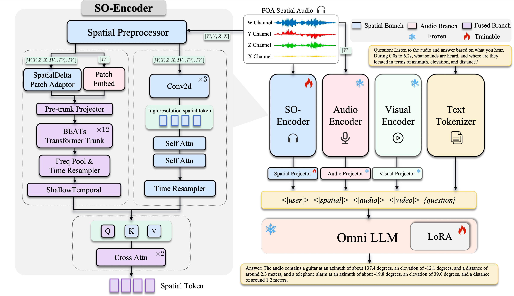

# Spatial-Omni · SO-AF3

[Paper](https://arxiv.org/abs/2606.10738) · [Models](https://huggingface.co/dieKarotte/Spatial-Omni) · [SO-Dataset](https://huggingface.co/datasets/dieKarotte/SO-Dataset) · [SO-Bench](https://huggingface.co/datasets/dieKarotte/SO-Bench)

Spatial-Omni integrates spatial audio understanding into **Audio Flamingo 3**. AF3's native Whisper encoder and audio projector are retained; a separate SO-Encoder and spatial projector supply first-order ambisonic (FOA) tokens to the language model.



## Models

| Branch | Backbone | Code | SO / MIX checkpoints |
| --- | --- | --- | --- |
| [main](https://github.com/dieKarotte/Spatial-Omni/tree/main) | Qwen2.5-Omni-7B | Available | [Available](https://huggingface.co/dieKarotte/Spatial-Omni/tree/main/SO-7B) |
| [SO-30B](https://github.com/dieKarotte/Spatial-Omni/tree/SO-30B) | Qwen3-Omni-30B-A3B-Instruct | Available | Pending |
| [SO-4B](https://github.com/dieKarotte/Spatial-Omni/tree/SO-4B) | Phi-4-multimodal | Available | Pending |
| [SO-AF3](https://github.com/dieKarotte/Spatial-Omni/tree/SO-AF3) | Audio Flamingo 3 | Available | Pending |

[SO-Encoder](https://huggingface.co/dieKarotte/Spatial-Omni/tree/main/SO-Encoder) is shared across the integrations. Adaptation checkpoints are specific to their backbone.

## Installation

Use Linux, an NVIDIA GPU, Python 3.11, PyTorch 2.5.1, Transformers 4.52.0 and PEFT 0.17.1. SDPA is the default attention implementation.

```bash
git clone --branch SO-AF3 https://github.com/dieKarotte/Spatial-Omni.git
cd Spatial-Omni
conda env create -f environment.yml
conda activate spatial-omni-so-af3
export HF_ENDPOINT=https://hf-mirror.com
hf download nvidia/audio-flamingo-3 --local-dir checkpoints/audio-flamingo-3
hf download dieKarotte/Spatial-Omni SO-Encoder/SO-Encoder.pt --local-dir checkpoints
export SO_BASE_MODEL="$PWD/checkpoints/audio-flamingo-3"
export SO_ENCODER_CKPT="$PWD/checkpoints/SO-Encoder/SO-Encoder.pt"
export SO_CHECKPOINT="$PWD/checkpoints/SO-AF3.pt"
export SO_MIX_CHECKPOINT="$PWD/checkpoints/SO-AF3-MIX.pt"
```

The last two paths are locations for your compatible local adaptation checkpoints; SO-AF3 weights are pending publication. Download the complete base repository, including its tokenizer, processor and configuration files.

The AF3 base directory must contain `llm/`, `sound_tower/` and `sound_mm_projector/`. The native Whisper encoder and audio projector load their complete pretrained weights; the SO branch initializes separately from SO-Encoder.

## Data

Use SO-Dataset for training and SO-Bench for evaluation. Follow the [download instructions and QA schema](https://github.com/dieKarotte/Spatial-Omni/tree/main#data), preserving `qa_id`, task metadata and reference answers. The examples below expect `qa/{train,valid,test}.jsonl` and dataset-relative audio paths.

```bash
export SO_DATASET_ROOT="$PWD/data/SO-Dataset"
export SO_BENCH_ROOT="$PWD/data/SO-Bench"
```

FOA recordings have four channels with W in channel 0; preserve the released channel order and coordinate convention. Audio is resampled to 16 kHz and limited to 20 seconds. The spatial branch projects 10 Hz encoder features to 2.5 Hz tokens. Mono QA uses the same JSONL schema with local mono audio.

## Inference

```bash
python so_audiollm/eval_af3_sobench.py \
  --model-dir "$SO_BASE_MODEL" --beats-checkpoint "$SO_ENCODER_CKPT" \
  --checkpoint "$SO_CHECKPOINT" \
  --qa-root "$SO_BENCH_ROOT/qa" --audio-root "$SO_BENCH_ROOT" \
  --output-dir outputs/so-af3 --batch-size 1 --max-samples 4 --max-new-tokens 48
```

Predictions are written to `outputs/so-af3/predictions_shard0.jsonl`. Use a fresh output directory for each run. For MIX mono input, prepare `data/mono/qa/test.jsonl` and its audio directory:

```bash
python so_audiollm/eval_af3_sobench.py \
  --model-dir "$SO_BASE_MODEL" --beats-checkpoint "$SO_ENCODER_CKPT" \
  --checkpoint "$SO_MIX_CHECKPOINT" --mono \
  --qa-root data/mono/qa --audio-root data/mono/audio --output-dir outputs/so-af3-mix-mono \
  --batch-size 1 --max-samples 4 --max-new-tokens 48
```

The MIX checkpoint's `spatial.spatial_null` parameter is reconstructed on load and supplies spatial tokens for mono input. Without a null bank, `--mono` uses W-only audio through the SO branch. For multi-process evaluation, set distinct `--shard` values with the same `--num-shards`; concatenate prediction files after all shards finish.

## Training

| Stage | `--train-mode` | Updated components |
| --- | --- | --- |
| 1 | `projector_only` | Spatial projector |
| 2 | `encoder_lora` | Projector and language LoRA |
| 3 | `beats_lora` | Projector, language LoRA and SO-Encoder |

The native Whisper encoder and native audio projector remain frozen.

```bash
bash shell/launch_train_so_af3.sh check
bash shell/launch_train_so_af3.sh smoke
bash shell/launch_train_so_af3.sh full
```

`check` prints the three-stage plan. `smoke` uses two GPUs, 256 training records, 16 validation records and two epochs per stage; `full` defaults to eight GPUs. `GPUS` is the process count, while `CUDA_VISIBLE_DEVICES` selects devices. Set `OUTPUT_ROOT` to a new run directory, `PYTHON` to the training interpreter and `NUM_WORKERS` per process. Learning rates scale with effective batch size.

To train MIX from an SO checkpoint, provide a flat replay JSONL with `audio_path`, `question` and `answer`. Audio paths must resolve under the training root or be absolute:

```bash
torchrun --standalone --nproc_per_node=2 train_so_af3.py \
  --model-dir "$SO_BASE_MODEL" --beats-checkpoint "$SO_ENCODER_CKPT" \
  --resume-checkpoint-path "$SO_CHECKPOINT" \
  --qa-root "$SO_DATASET_ROOT/qa" --audio-root "$SO_DATASET_ROOT" \
  --train-mode beats_lora --replay-qa-roots data/replay/train.jsonl --spatial-replay-ratio 3 \
  --batch-size 1 --grad-accum-steps 4 --epochs 2 --num-workers 2 \
  --lr 1e-6 --lora-lr 3e-5 --beats-lr 1e-6 --output-dir runs/so-af3-mix
```

MIX uses three spatial slots per replay slot. The learned null bank supplies mono spatial tokens; an alignment loss trains the W-only encoder output toward that bank.

## Checkpoints

Checkpoints are raw trainable state dictionaries, omitting frozen base weights and optimizer state. Keep the exact base revision and matching `train_args.json`. The evaluator expects a complete stage-3 checkpoint with matching LoRA settings (defaults: rank 16, alpha 32); use `--lora-r` and `--lora-alpha` for another configuration.

Training writes `train_args.json`, TensorBoard events and `checkpoints/last_trainable.pt`. Pass that file to the next stage's `--resume-checkpoint-path`, using a new output directory. This initializes model weights; optimizer, scheduler and step state start fresh. Existing run configurations and checkpoint outputs are protected. Run inference with the newly saved file and a fresh output directory to check reload.

## Evaluation

Generation and scoring are separate. For the four-question example, validate alignment without contacting a judge:

```bash
python scripts/score_sobench.py \
  --predictions-jsonl outputs/so-af3/predictions_shard0.jsonl \
  --qa-root "$SO_BENCH_ROOT/qa" --split test --expected-examples 4 --dry-run
```

For a full result, remove the generation limit and score all 7,877 questions. Set `OPENAI_API_KEY` before live judging:

```bash
python scripts/score_sobench.py \
  --predictions-jsonl outputs/so-af3/predictions_shard0.jsonl \
  --qa-root "$SO_BENCH_ROOT/qa" --split test --expected-examples 7877 \
  --model gpt-4o-mini --require-api --no-skip-sensitive-api-errors \
  --angle-threshold-deg 20 --elevation-threshold-deg 10 \
  --distance-threshold-m 1.0 --time-threshold-s 0.2 \
  --detect-source-time-policy event_only --spatial-temporal-time-policy semantic_times_iou \
  --output-json outputs/so-af3/score.json --judged-jsonl outputs/so-af3/judged.jsonl \
  --cache-jsonl outputs/so-af3/judge_cache.jsonl
```

Use `--offline` with a complete judge cache to recompute local scores. See the [evaluation protocol](https://github.com/dieKarotte/Spatial-Omni/tree/main#evaluation) for aggregation, API error handling and cache reuse.

The recorded protocol uses 20° azimuth, 10° elevation, 1 m distance and 0.2 s onset tolerances; the paper's Appendix D lists different distance/onset tolerances. Report the protocol alongside scores. A four-question check and the legacy `score_test_predictions.py` are not full SO-Bench results.

## Citation

```bibtex
@misc{zhu2026spatialomnispatialaudiounderstanding,
      title={Spatial-Omni: Spatial Audio Understanding Integration in Multimodal LLMs via FOA Encoding},
      author={Zhiyuan Zhu and Yixuan Chen and Yiwen Shao and Wenxiang Guo and Changhao Pan and Yu Zhang and Yuxiang Wang and Wei Liu and Houhua Zhang and Chengkuan Zeng and Wenbo Cheng and Yunxi Liu and Rui Yang and Steve Yves and Liefeng Bo and Zhou Zhao},
      year={2026},
      eprint={2606.10738},
      archivePrefix={arXiv},
      primaryClass={eess.AS},
      url={https://arxiv.org/abs/2606.10738},
}
```

## License

Code is released under [Apache 2.0](LICENSE). Base-model weights, datasets and third-party components retain their respective licenses.
